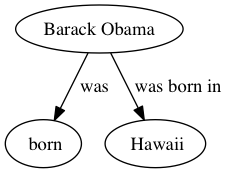

# Python wrapper for Stanford OpenIE

The unofficial cross-platform Python wrapper for the <b>state-of-art</b> information extraction library from Stanford University.

```
NOTE: Windows is not currently supported! Works on UNIX systems like Linux and Mac OS.
```

## About Stanford IE

Open information extraction (open IE) refers to the extraction of structured relation triples from plain text, such that the schema for these relations does not need to be specified in advance. For example, Barack Obama was born in Hawaii would create a triple (Barack Obama; was born in; Hawaii), corresponding to the open domain relation "was born in". This software is a Java implementation of an open IE system as described in the paper:

Gabor Angeli, Melvin Johnson Premkumar, and Christopher D. Manning. Leveraging Linguistic Structure For Open Domain Information Extraction. In Proceedings of the Association of Computational Linguistics (ACL), 2015.
The system first splits each sentence into a set of entailed clauses. Each clause is then maximally shortened, producing a set of entailed shorter sentence fragments. These fragments are then segmented into OpenIE triples, and output by the system. 

More information can be found here : http://nlp.stanford.edu/software/openie.html

## Usage

First of all, make sure Java 1.8 is installed. Open a terminal and run this command to check:

```
java -version
```

If this is not the case and if your OS is Ubuntu, you can install it this way:

```
sudo add-apt-repository ppa:webupd8team/java
sudo apt-get update
sudo apt-get install oracle-java8-installer
```

The code can be invoked either programmatically or through the command line. The program can be invoked with the following command. It will display ```[['Barack Obama', ' was', ' born'], ['Barack Obama', ' was born in', ' Hawaii']]```
```
git clone https://github.com/philipperemy/Stanford-OpenIE-Python.git
cd Stanford-OpenIE-Python
echo "Barack Obama was born in Hawaii." > samples.txt
python main.py -f samples.txt
```

## Generate Graph

```
echo "Barack Obama was born in Hawaii." > samples.txt
python main.py -f samples.txt -g
```
Will generate a [GraphViz DOT](http://www.graphviz.org/) graph and its related PNG file in `/tmp/openie/`

<div align="center">
  <br><br>
</div>

Note: Make sure GraphViz is installed beforehand. Try to run the `dot` command to see if this is the case. If not, run `sudo apt-get install graphviz` if you're running on Ubuntu. 

## Support

You can either open an `Issue` or send me a e-mail to premy@reactive.co.jp. Any contributions are welcomed!

